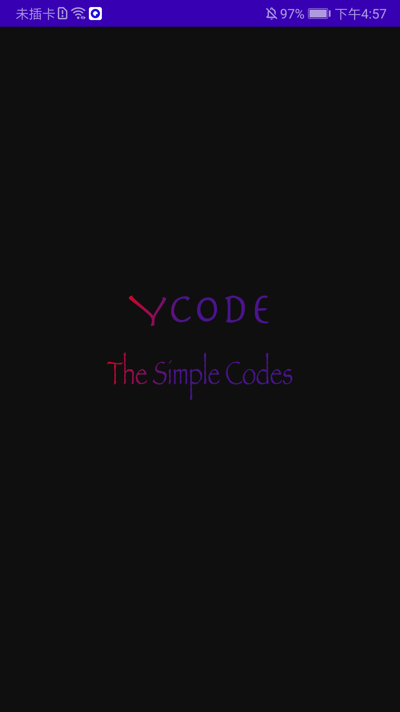

# YLightFontText

[](https://jitpack.io/#YpwCode/YLightFontText)

类似 iOS 早期滑动解锁文字高亮闪光动画



## 使用方式

**添加 Maven 库地址到项目根目录下的 build.gradle**
```groovy
allprojects {
	repositories {
		...
		maven { url 'https://jitpack.io' }
	}
}
```

**添加依赖项**
```groovy
dependencies {
        implementation 'com.github.YpwCode:YLightFontText:1.0.0'
}
```

## 说明

| 属性 | 描述 |
|---|---|
| lft_lightColor | 高亮色 |
| lft_lightWidth | 高亮区域宽度, 0: view 宽度 |
| lft_duration | 动画时间 |
| lft_repeatCount | 重复次数, -1: 一直 |
| lft_family | 字体 |